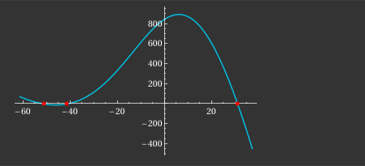

---
layout: archive
title: "Quadratic Integrate-and-Fire Neuron"
permalink: /notes/neuronal-dynamics/qif-neuron/
author_profile: false
--- 

The Hodgkin-Huxley model can be simplified into various 1-D systems (and 2-D and 3-D, as it is a 4-D system). Even in the 1-D case, we can identify four fundamental models: one for each combination of activation vs. inactivation gating and inward vs. outward current. The typical choice for preliminary analysis is the so called **Leak + Instantaneous Sodium Model**, usually referred to as the **persistent sodium model**. In this model we consider \\(p\\) as an activation gate variable and our only one (as opposed to the 4-D Hodgkin-Huxley model with 3 gating variables). Essentially, this captures the voltage dynamics for a neuron with only one type of channel (sodium channel) and with only 1 activation gate. The model, as mentioned, also has a leaky outward current (typically representing the leaky nature of potassium \\(K^{+}\\)). As for our sodium current, the current is what's referred to as **persistent**. This means that once it is activated, it has no inactivation mechanisms,  resulting in the current continuing to flow. The following is the described system, however, it is not 1 dimensional yet but we will make some assumptions to reduce it to 1-D.
\\[C\dot{V} = I - g_L(V-E_L)-gp(V-E)\\]
\\[\dot{p} = \frac{(p_{\infty}(V) - p)}{\tau(V)}\\]
Now, to simplify we make the claim that the dynamics of the gating variable \\(p\\) occur very fast, much faster than the voltage dynamics. From this, we regard the gating process (think of the process of the gates physically opening) as instantaneous. So instead of the reality of the gating process taking some time (even if it's very small), we just assume that they respond instantly to the voltage. With this, we can replace \\(p\\) with its stead state asymptotic value. Therefore, we have that 
\\[p = p_{\infty}(V)\\]
The function above is derived experimentally. Now our equation reduces to,
\\[C\dot{V} = I - g_L(V-E_L)-gp_{\infty}(V)(V-E)\\]
This is now a 1-D system. As mentioned, we want to consider the sodium channels. The model above is generalized for any ensemble of identical channels with 1 instantaneous gating variable. We rewrite the equation with sodium in mind to get,
\\[C\dot{V} = I - g_L(V-E_L)-g_{Na}m_{\infty}(V)(V-E_{Na})\\]
We replace \\(p\\) with \\(m\\) because we are considering sodium channels that only use activation gates (most channels have both inactivation and activation, but this is for initial simplicity). Now below are the experimentally derived constants and functions.
\\[m_{\infty}(V) = \frac{1}{1+e^{\frac{V_{1/2}-V}{k}}}\\]
\\[C = 10\mu F, I = 0 \text{pA}, g_L = 19 \ mS, E_L = -67 \ mV\\]
\\[g_{Na} = 74 \ mS, V_{1/2} = 1.5 \ mV, k = 16 \ mV, E_{Na} = 60 \ mV\\]
Plugging these into our equation, we get
\\[10\dot{V} = -19(V+67)-74\left(\frac{1}{1+e^{\frac{1.5-V}{16}}}\right)\left(V-60\right)\\]
Now the goal is to determine the qualitative nature of this differential equation. Analytically no solution exists (I believe). Therefore, we need to use the tools of nonlinear dynamics to understand this model. The first part of this process is **fixed point analysis**. 
## Fixed Point Analysis

The first step in understanding the aforementioned dynamics, is to find the fixed points (also known as equilibrium points). This is done by setting \\(\dot{V} = 0\\) and solving for \\(V\\). 
\\[-19(V+67)-74\left(\frac{1}{1+e^{\frac{1.5-V}{16}}}\right)\left(V-60\right) = 0\\]
We cannot solve this analytically because it's a messy implicit equation. Instead we can numerically compute the zeros of the equation. Doing this gives us three fixed points: \\(x_1 \approx -52.51, \ x_2 \approx -41.5148, \ x_3 \approx 30.9528\\). Sketching the graph gives us:
\\

Where the x-axis represents voltage, and the y-axis is the derivative of voltage. The analysis now is straight forward. For the leftmost region (\\(V < -52.51\\)), the function is positive. This means that any starting voltage less than roughly \\(-52.52\\) will increase until it gets to the point \\(-52.51\\), at which it will stay forever (unless there are some external perturbations). This is considered a stable equilibrium (and is also called an attractor), since all nearby initial conditions will converge to that equilibrium point. Now to further demonstrate that stability, consider the region between the two leftmost fixed points, that is \\(-52.51 < V < -41.5148 \\). The function here is negative, meaning that any initial voltage in this range will be pushed to the left, towards \\(-52.51\\), and stay there forever (unless there are some external perturbations). Therefore, we see that any starting voltage sufficiently close to the fixed point \\(-52.51\\), will converge to \\(-52.51\\) as \\(t\to \infty)\\), meaning the fixed point is a stable equilibrium. Now, consider voltages of \\(-41.51 < V < 30.9528\\) we see that there is new behavior. The graph here is positive, meaning the flow will be to the right, until reaching the final fixed point \\(30.9528\\) and settling there forever (unless there are some external perturbations). What this means is that \\(-41.5148\\) is an unstable equilibrium. Any initial voltage near it will be pushed away from it. The only exception being if the voltage is exactly \\(-41.5148\\). The last segment to consider is the set of points greater than the last fixed point, so \\(V > 30.9528\\). The graph here is negative, meaning the flow will be towards the left, back to the fixed point \\(30.9528\\). As we can see, this final fixed point is a stable equilibrium (an attractor). Another thing to note is that in 1 dimension, two stable equilibria must be separated by an unstable equilibrium. We interpret this stable equilibrium of around \\(30.9528\\) as the excited state of a neuron, whereas the stable equilibrium of \\(-52.51\\) to be our rest state. Therefore, the point \\(-41.5148\\) acts as a threshold of whether the neuron will go to rest or excite. The values roughly correlate to the actual resting potential of a neuron and the excited potential of that neuron. Below is a graph of the evolution of voltage in time. As you can see, all initial voltage values will be attracted to one of the two stable equilibrium, and their basins of attraction are separated by the unstable equilibrium \\(-41.5148\\).

