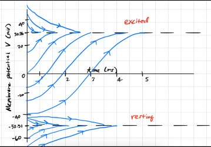

---
layout: archive
title: "Quadratic Integrate-and-Fire Neuron"
permalink: /notes/neuronal-dynamics/qif-neuron/
author_profile: false
--- 

The Hodgkin-Huxley model can be simplified into various 1-D systems (and 2-D and 3-D, as it is a 4-D system). Even in the 1-D case, we can identify four fundamental models: one for each combination of activation vs. inactivation gating and inward vs. outward current. The typical choice for preliminary analysis is the so called **Leak + Instantaneous Sodium Model**, usually referred to as the **persistent sodium model**. In this model we consider \\(p\\) as an activation gate variable and our only one (as opposed to the 4-D Hodgkin-Huxley model with 3 gating variables). Essentially, this captures the voltage dynamics for a neuron with only one type of channel (sodium channel) and with only 1 activation gate. The model, as mentioned, also has a leaky outward current (typically representing the leaky nature of potassium \\(K^{+}\\)). As for our sodium current, the current is what's referred to as **persistent**. This means that once it is activated, it has no inactivation mechanisms,  resulting in the current continuing to flow. The following is the described system, however, it is not 1 dimensional yet but we will make some assumptions to reduce it to 1-D.
\\[C\dot{V} = I - g_L(V-E_L)-gp(V-E)\\]
\\[\dot{p} = \frac{(p_{\infty}(V) - p)}{\tau(V)}\\]
Now, to simplify we make the claim that the dynamics of the gating variable \\(p\\) occur very fast, much faster than the voltage dynamics. From this, we regard the gating process (think of the process of the gates physically opening) as instantaneous. So instead of the reality of the gating process taking some time (even if it's very small), we just assume that they respond instantly to the voltage. With this, we can replace \\(p\\) with its stead state asymptotic value. Therefore, we have that 
\\[p = p_{\infty}(V)\\]
The function above is derived experimentally. Now our equation reduces to,
\\[C\dot{V} = I - g_L(V-E_L)-gp_{\infty}(V)(V-E)\\]
This is now a 1-D system. As mentioned, we want to consider the sodium channels. The model above is generalized for any ensemble of identical channels with 1 instantaneous gating variable. We rewrite the equation with sodium in mind to get,
\\[C\dot{V} = I - g_L(V-E_L)-g_{Na}m_{\infty}(V)(V-E_{Na})\\]
We replace \\(p\\) with \\(m\\) because we are considering sodium channels that only use activation gates (most channels have both inactivation and activation, but this is for initial simplicity). Now below are the experimentally derived constants and functions.
\\[m_{\infty}(V) = \frac{1}{1+e^{\frac{V_{1/2}-V}{k}}}\\]
\\[C = 10\mu F, I = 0 \text{pA}, g_L = 19 \ mS, E_L = -67 \ mV\\]
\\[g_{Na} = 74 \ mS, V_{1/2} = 1.5 \ mV, k = 16 \ mV, E_{Na} = 60 \ mV\\]
Plugging these into our equation, we get
\\[10\dot{V} = -19(V+67)-74\left(\frac{1}{1+e^{\frac{1.5-V}{16}}}\right)\left(V-60\right)\\]
Now the goal is to determine the qualitative nature of this differential equation. Analytically no solution exists (I believe). Therefore, we need to use the tools of nonlinear dynamics to understand this model. The first part of this process is **fixed point analysis**. 
## Fixed Point Analysis

The first step in understanding the aforementioned dynamics, is to find the fixed points (also known as equilibrium points). This is done by setting \\(\dot{V} = 0\\) and solving for \\(V\\). 
\\[-19(V+67)-74\left(\frac{1}{1+e^{\frac{1.5-V}{16}}}\right)\left(V-60\right) = 0\\]
We cannot solve this analytically because it's a messy implicit equation. Instead we can numerically compute the zeros of the equation. Doing this gives us three fixed points: \\(x_1 \approx -52.51, \ x_2 \approx -41.5148, \ x_3 \approx 30.9528\\). Sketching the graph gives us:
\\

\\
Where the x-axis represents voltage, and the y-axis is the derivative of voltage. The analysis now is straight forward. For the leftmost region (\\(V < -52.51\\)), the function is positive. This means that any starting voltage less than roughly \\(-52.52\\) will increase until it gets to the point \\(-52.51\\), at which it will stay forever (unless there are some external perturbations). This is considered a stable equilibrium (and is also called an attractor), since all nearby initial conditions will converge to that equilibrium point. Now to further demonstrate that stability, consider the region between the two leftmost fixed points, that is \\(-52.51 < V < -41.5148 \\). The function here is negative, meaning that any initial voltage in this range will be pushed to the left, towards \\(-52.51\\), and stay there forever (unless there are some external perturbations). Therefore, we see that any starting voltage sufficiently close to the fixed point \\(-52.51\\), will converge to \\(-52.51\\) as \\(t\to \infty\\), meaning the fixed point is a stable equilibrium. Now, consider voltages of \\(-41.51 < V < 30.9528\\) we see that there is new behavior. The graph here is positive, meaning the flow will be to the right, until reaching the final fixed point \\(30.9528\\) and settling there forever (unless there are some external perturbations). What this means is that \\(-41.5148\\) is an unstable equilibrium. Any initial voltage near it will be pushed away from it. The only exception being if the voltage is exactly \\(-41.5148\\). The last segment to consider is the set of points greater than the last fixed point, so \\(V > 30.9528\\). The graph here is negative, meaning the flow will be towards the left, back to the fixed point \\(30.9528\\). As we can see, this final fixed point is a stable equilibrium (an attractor). Another thing to note is that in 1 dimension, two stable equilibria must be separated by an unstable equilibrium. We interpret this stable equilibrium of around \\(30.9528\\) as the excited state of a neuron, and the stable equilibrium of \\(-52.51\\) as our rest state. Therefore, the point \\(-41.5148\\) acts as a threshold of whether the neuron will go to rest or excite. The values roughly correlate to the actual resting potential of a neuron and the excited potential of that neuron. Below is a graph of the evolution of voltage in time. As you can see, all initial voltage values will be attracted to one of the two stable equilibrium, and their basins of attraction are separated by the unstable equilibrium \\(-41.5148\\).\\
\\
This system is said to be bi-stable, i.e. having two points of stability. However, stability depends on parameters of our differential equation. In our case, the input current is the only parameter that we can freely change. In our analysis so far, \\(I = 0\\) pA has been our input current (so none). But what would happen if we changed this? Would there be a qualitative change in our dynamics and if there was, where would it happen? This leads us to the bifurcation analysis part of our investigation.

## Bifurcation Analysis
This part of the analysis focuses on how a parameter of our differential equation can change the qualitative behavior of our system. This qualitative change in dynamics is called a bifurcation. In our case, input current can create or destroy our fixed points and their stability. Currently we have a bi-stable system, but we can change this by inputting different amounts of current. If we look back at our first graph, we can see that shifting the graph up or down would change these fixed points. We would have to shift it down quite drastically to destroy all fixed points. However, shifting it up just a little would completely destroy two of our fixed points. Recall that our original differential equation had an additive \\(I\\) current term. We set this to \\(0\\) for preliminary analysis, but not we want to revisit its importance. Shifting the graph up would correspond to adding a value to our differential equation. As mentioned, \\(I\\) is already being added to the equation, it is just simply \\(0\\) for now. The question then becomes, how much can we shift it up before the bi-stability breaks, and a qualitative change in our dynamics occur (bifurcation). Well, shifting the graph up a little would result in the two leftmost equilibria to grow closer. Below is what's called a bifurcation diagram. Without going into too much detail, there is a topological equivalence to a system with a quadratic term shifted by some constant \\(I\\). We can take that quadratic graph, flip it on its side, and find the point of symmetry which is where the bifurcation occurs. In our case it's \\(I = 16\\) that causes this bifurcation.\\
\\
This bifurcation is what's called a **saddle-node bifurcation**. Again, without going into much detail, there are usually what's called a **topological normal form** for certain bifurcations. Often it is easier to analytically consider the normal form, since the qualitative behavior of the normal form (usually, under conditions) corresponds to the same behavior as the system with the same type of bifurcation.

## Hartman-Grobman Theorem
If we cannot find a globally topologically equivalent system to make our analysis simpler, we can consider local topological equivalence. We essentially consider small neighborhoods around a fixed point. The **Hartman-Grobman Theorem** tells us that a non-linear 1-D system 
\\[\dot{V} = F(V)\\]
close enough to a fixed point, say \\(V_{eq}\\), is locally topologically equivalent to the linear system
\\[\dot{V} = \lambda\left(V-V_{eq}\right)\\]
if the eigenvalue
\\[\lambda = F'(V_{eq})\\]
Is non-zero. From this, we know the solution to a 1-D linear system, and can therefore analyze the behavior of the non-linear system via the solution to the linear one. Exponential growth implies instability, whereas exponential decay corresponds to stability. If our eigenvalue is \\(0\\), then we cannot use this method. Fixed points that have this property are called **hyperbolic equilibrium**. 

## Topological Normal Form for Saddle-Node Bifurcation
As mentioned, we can consider the normal form for dynamics that contain the same bifurcations. In this case the normal form is
\\[\dot{V} = I + V^2\\]
This reduction gives us the so called **Quadratic Integrate-and-Fire Neuron**. Note that these topological normal forms are only meaningful near the local neighborhood of a fixed point. However, both of the fixed points that we were considering before (rest and excited), are hyperbolic. Therefore, this reduction can represent either of them. We need to know the fixed points of this system, there are different equilibria for different values of \\(I\\). Let's consider them,
\\[I < 0: V_{rest} = -\sqrt{|I|} \text{ and } V_{thresh} = \sqrt{|I|}\\]
\\[I = 0: V_{thresh} = V_{rest}\\]
\\[I > 0: \text{ no equilibria since } V_{thresh} = V_{rest} \text{, previously (bifurcation)}\\]
When \\(I > 0\\), we have that \\(\dot{V} \geq 0\\) since both \\(I\\) and \\(V^2\\) are positive, so voltage will only increase. This creates a rapid positive feedback loop, causing voltage to go to infinity in finite time. To simulate this realistically, we just clamp the value at a maximum value \\(V_{max}\\) and reset it to a reset value \\(V_{reset}\\). This mentioned simulation is what's called the **Quadratic Integrate-and-Fire Neuron**, since it represents a threshold for the characteristic action potential, as well as a repolarization process (although instantaneous and slightly unrealistic). This type of neuron is called an **integrator**, as it sort of sums up the inputs; granted they occur in a short enough time frame. Once it hits its the threshold, it spikes rapidly (representative of an action potential). If it does not reach its threshold, it will die down towards \\(V_{rest}\\). We can observe some other interesting dynamics even in this simple model. This model can exhibit a single action potential, or a repetitive spiking behavior once it hits its threshold for the first time. 

## Simulations
I have simulated the aforementioned system, with a time step (dt) of 0.01, for roughly 10 seconds (1,000 derivative updates). The system above simulates a constant current (although we can make current a function of time and observe its dynamics). Let's consider the different behaviors that this model can take based off of the input current \\(I\\).

### I < 0
We know that we will have two equilibria, \\(V_{rest} = -\sqrt{|I|}\\) and \\(V_{thresh} = +\sqrt{|I|}\\). Reaching \\(V_{thresh}\\) will result in our action potential. Not reaching it will result in the voltage to die down towards \\(V_{rest}\\). So we know that the voltage will be essentially dictated by the constant current. So, what can we change? The main thing here would be the starting voltage, obviously setting a high start will cause it to spike and then reset. This isn't particularly interesting. Because of the quadratic nature, we know that voltages starting to the left of \\(V_{rest}\\) will be pushed up to \\(V_{rest}\\), voltages starting between \\(V_{rest}\\) and \\(V_{thresh}\\) will be pushed to the left towards \\(V_{rest}\\) because this corresponds to the part of the parabola below the x-axis, i.e. negative derivative \\(\implies\\) decreasing. Voltages above \\(V_{thresh}\\) are on the positive part of the parabola and are therefore increasing without bound (to infinity, this is a spike). So what else could change the dynamics. The reset value \\(V_{reset}\\). If this is sufficiently high, we will get tonic spiking (repetitive) once it spikes for the first time. How high does it have to be? We know the bifurcation point is \\(0\\), so setting it above zero will cause repetitive spiking, setting it below will cause it to die, even if it spikes once. First is an example of non-tonic spiking. I use the following parameters: \\(I = -25\\) since this has a perfect square root and therefore easier to analyze equilibria (5). \\(V_0 = 5.001\\), just enough so that it's greater than \\(5\\) and therefore will trigger an action potential. \\(V_max = 50\\), this is not too important. \\(V_{reset} = 4.999999\\), this is so that after a spike, it will be in the basin of attraction for the rest state (\\(V = -5.0\\)), and therefore decay towards the resting value. Here is the simulation, \\

\\
Now, I will change \\(V_{reset}\\) to \\(5\\), this will result in a spike and then a sustained potential of \\(V=0.5\\) since it's an equilibrium point and therefore no change will occur there.

