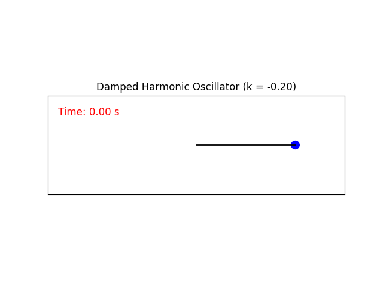

---
layout: archive
title: "The Damped Harmonic Oscillator"
permalink: /notes/odes/harmonic-oscillator/
author_profile: false
--- 

One of the simplest 2nd order ODEs that we can solve explicitly, is the so called **damped harmonic oscillator**. We will begin with the derivation of this ODE with some basic Newtonian mechanics. First, imagine that there is a small object attached to the end of a spring. This spring, when pulled, exerts a restoring force on the object, and assume that there is some form of friction on the object (either by air or ground). See the video below for more intuition.
 \\
Now, Newton's second law of motion states that the force being applied to an object is equal to the mass of that object times its acceleration, or more formally,
\\[F_{\text{net}} = m\cdot a\\]
By Hooke's law, the force that a spring exerts on an object is given by 
\\[F_{\text{spring}} = -kx\\]
Where \\(k\\) is called the spring constant and \\(x\\) is the displacement of the object. The force acting on the object via friction is given by 
\\[F_{\text{friction}} = -cv\\]
Where \\(c\\) is the damping coefficient and \\(v\\) is the velocity of the object. Therefore, the net force on the object is the sum of these two forces,
\\[F_{\text{net}} = F_{\text{spring}} + F_{\text{friction}} = -kx - cv\\]
We note that velocity is the derivative of displacement, and therefore, can rewrite the equation with \\(v = \dot{x}\\), to get
\\[F_{\text{net}} = -kx - c\dot{x}\\]
By Newton's second law above, we then have that
\\[ma = -kx - c\dot{x}\\]
Again, acceleration is the second derivative of displacement, so we can rewrite our equation with \\(a = \ddot{x}\\), to get
\\[m\ddot{x} = -kx - c\dot{x}\\]
Depending on the coefficients, we could get different solutions. But let's imagine there was no friction, instead, our object would oscillate back and forth between the endpoints and the center. The equation would reduce to, 
\\[m\ddot{x} = -kx\\]
The solution to this ODE is simply
\\[x(t) = Ccos(\sqrt{\frac{k}{m}}t + \phi\\]
In other words, we can predict the future motion of this object through this equation. 
