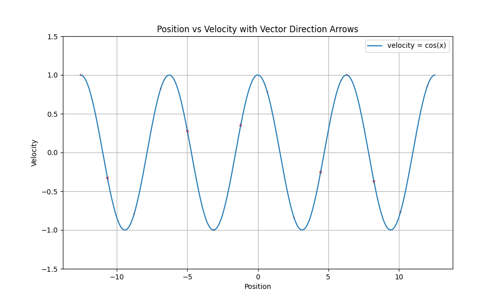

---
layout: archive
title: "Understanding Phase Portraits and Intuition Behind ODEs"
permalink: /notes/odes/phase-portraits/
author_profile: false
--- 

If we denote the position of some object by the function \\(x(t)\\), then by definition, the velocity of that object is defined by the derivative of its displacement (which is the position) and therefore the velocity is simply \\(\dot{x}\\). As I go through various ODEs, you should keep this relationship in the back of your head. Now, let's consider the most basic ODE:
\\[\dot{x} = Cx\\]
Where \\(C\\) is just some constant. In a more general form, this is 
\\[\dot{x} = f(x)\\]
Where \\(f(x)\\) is just some function of \\(x\\) like above. To begin with, we only consider linear ODEs, which are ones where the \\(x\\) term is not raised to a power, and is not multiplied to a function of \\(x\\). Keep in mind, \\(x = x(t)\\), in other words, \\(x\\) itself is a function of time (think position/displacement). Now, what equations of this form tell us, is that our object's velocity is dependent on where the object is (more or less). Since our velocity is a function of position, then where we are in a certain path determines how fast we are moving. Now, the ODE above can be solved easily by separation of variables and integrating. That is, we rewrite
\\[\dot{x} = \frac{dx}{dt}\\]
So our equation becomes,
\\[\frac{dx}{dt} = Cx\\]
Moving all \\(x\\) and \\(t\\) variables, we get
\\[\frac{1}{x}dx = Cdt\\]
Integrating both sides, gives
\\[\ln(x) = Ct + A\\]
Where \\(A\\) is just the constant of integration, then expnentiating to isolate \\(x\\), 
\\[x = e^{Ct+A} = e^{Ct}e^{A}\\]
\\(e^{A}\\) is simply a constant, so we will write it as \\(\alpha\\) instead. Then our solution is
\\[x(t) = \alpha e^{Ct}\\]
Now if we impose an initial condition when \\(t=0\\), this is equivalent to "telling" the equation where we want our path to start. Since, at \\(t=0\\) our equation reduces to \\(x(0) = \alpha e^0 = \alpha\\). In other words, if we require that 
\\[x(0) = K\\]
Where \\(K\\) is an arbitrary constant, then we must have that \\(\alpha = K\\). Now, we want to understand what this equation is actually telling us. We will consider various values of \\(C\\). 

## C < 0
In this scenario, our trajectory will **decay** towards \\(0\\) exponentially as \\(t \to \infty\\). However, it is asymptotic at \\(0\\), meaning it never actually reaches \\(0\\) (which we would expect because \\(e\\) never touches the x-axis). The actual value of \\(C\\) will determine how fast that decay happens. A \\(C\\) further away from \\(0\\) will decay faster. Note that no matter where we start from on the x-axis, we will approach the line \\(x=0\\) but never touch it.

## C = 0
This is a trivial case where the position of the object is constant from wherever it starts. Meaning there is no change in position so therefore no velocity.

## C > 0
In this case, no matter where you start at, you will eventually go towards infinity. Meaning you will just get further and further away from the x-axis.

## Nonlinear Example
The example above is simple and somewhat boring, the trajectory of certain starting points does not really change. Let's consider the ODE
\\[\dot{x} = \cos (x)\\]
In other words, the velocity of the object that obeys this ODE increases, and decreases with respect to the \\(\cos\\) function. We can plot the position of the object with respect to its velocity, which would just look like a \\(\cos\\) graph

